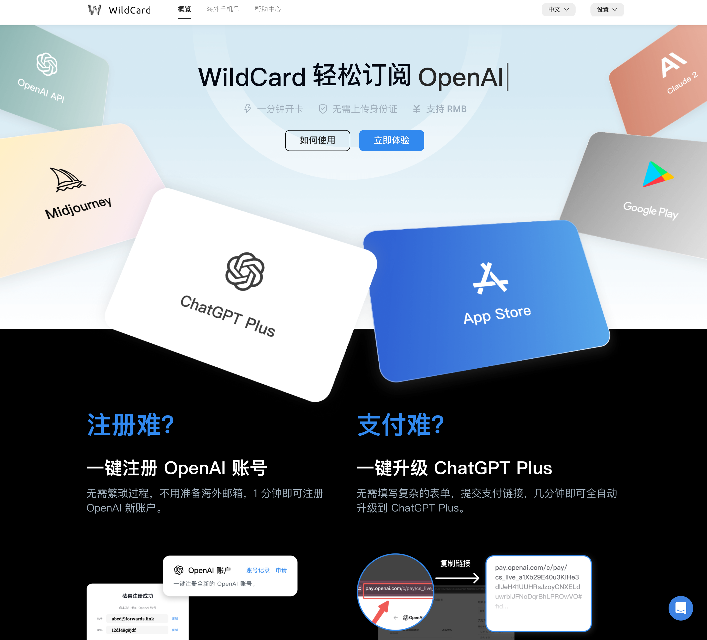
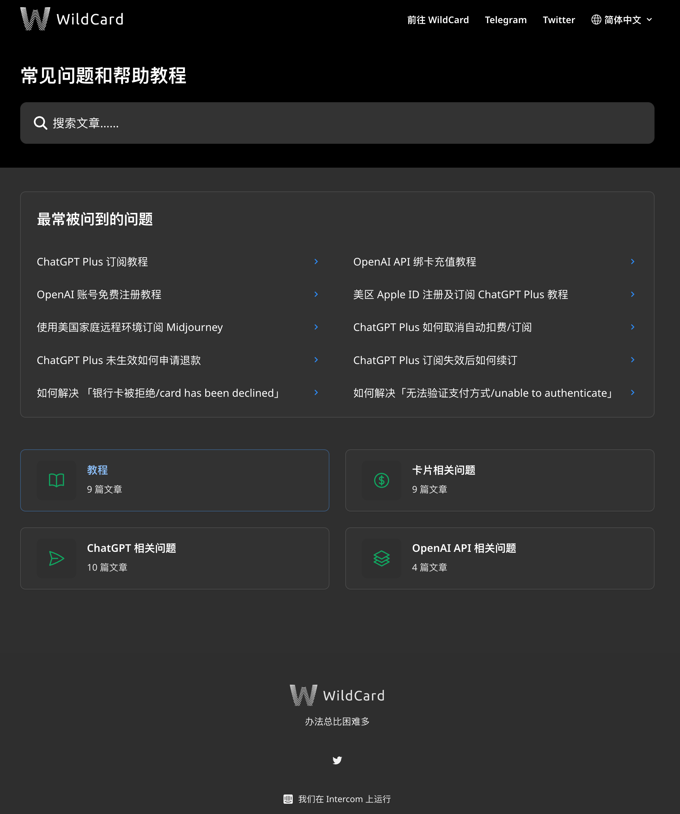

# bewildcard 介绍

:::warning URL⭐️
感兴趣的朋友可以通过这个链接进行开通 GPT4 以及相关服务 <https://bewildcard.com/>
:::

[[toc]]

## 升级 GPT4 的难点

## bewildcard 是什么

这是一个由国人开发的，通过海外虚拟信用卡进行充值的平台，解决海外充值难的问题

⭐️ [WildCard | 一分钟开卡，轻松订阅海外软件服务 (bewildcard.com)](https://bewildcard.com/)

## 重点解决的问题

- 注册：注册的时候，如 openai，可能会需要提供海外手机号验证码
- 支付：因为海外针对支付的时候，会查看我们的 ip，如果只是翻墙的话，会有可能支付失败

## 特点

- 快速响应：右下角人工客服快速响应，客服小哥哥小姐姐都很耐心
- 文档齐全：针对常见的问题，补充了相关的文档，对新手友好
- 服务齐全：目前我最常用的 openai 升级会员（GPT4），但是 bewildcard 也可以针对 midjourney（绘图），claude 等开通其他注册服务

