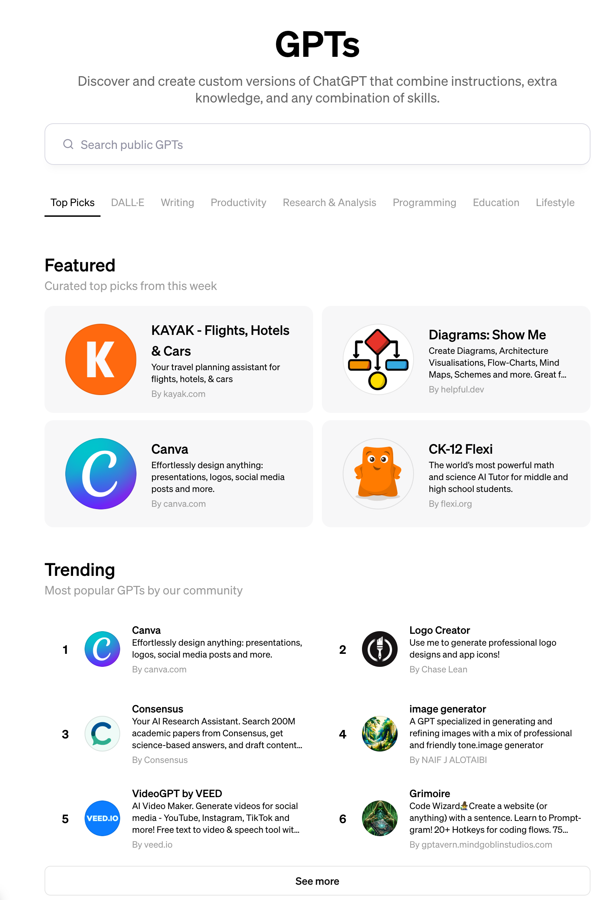

# GPTs

[[toc]]

## GPTs 简介

<https://openai.com/blog/introducing-gpts>
GPTs 是 openai 官方推出的, 可以结合更多的工具, 进行某个领域特定工作的特定版本的 GPT. 以下参考 openai 的官方定义

:::info

- GPTs are a new way for anyone to **create a tailored version of ChatGPT to be more helpful in their daily life**, at specific tasks, at work, or at home—and then share that creation with others. For example, GPTs can help you learn the rules to any board game, help teach your kids math, or design stickers.
- GPTs let you customize ChatGPT for a specific purpose
  :::

## 能做什么

-

## 参考别人的 GPTs

### 官方榜单

现在 OPENAI 官方已经推出了自己的 GPTs 商店, 小伙伴们可以根据这个 URL <https://chat.openai.com/gpts> 去看下, 我选取了部分 GPTs 的截图供参考

### 第三方榜单

- <https://www.gptshunter.com/>: 收录非常全面的 GPTs
- <https://gpts-store.net/>

## 制作自己的 GPTs

如果我们想要制作自己的 GPTs, 除了参考官方的引导过程, 我们也可以参考现有的 GPTs 的 prompt 制作过程, 进行借鉴.

这里给出一个仓库, 可以参考别人制作的 GPTs 所用到的指令：[https://github.com/linexjlin/GPTs/tree/main](https://github.com/linexjlin/GPTs/tree/main)

这里列出仓库的一部分 GPTs Prompt
